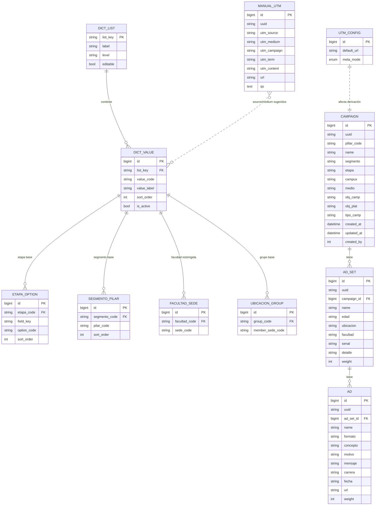

# SDD – UTP · Constructor de Nomenclaturas
### Spec-Driven Development para reconstrucción full-stack y despliegue en Drupal

> **Cómo leer este documento.**
> Este documento describe cómo el *Constructor de Nomenclaturas* pasa de ser una herramienta en un solo archivo HTML (`UTP-Nomenclaturas.html`, la que UTP ya usa y valida hoy) a una solución full-stack sobre Drupal, sin cambiar ninguna regla de negocio en el camino: el HTML sigue siendo la *fuente de verdad funcional* — sus reglas y su diccionario ya están aprobados por UTP — y este `.md` documenta la arquitectura destino y cómo se llega a ella.
>
> Se organiza en tres bloques: **contexto y decisiones de arquitectura** (§0-1), **especificación técnica** — dominio, reglas de negocio, esquema de base de datos, API, frontend e integración con Drupal (§2-9) —, y **plan de entrega**, con la ruta de migración de datos y las fases de construcción junto con sus criterios de aceptación (§10-12). Los Anexos incluyen los datos semilla, constantes y paleta de diseño necesarios para implementar cada fase sin tener que volver al HTML original.

---

## 0. Contexto y objetivo

| | |
|---|---|
| **Qué existe hoy** | SPA vanilla (HTML/CSS/JS) autónoma, con persistencia en `localStorage`. Un solo archivo. Sin backend, sin multiusuario, sin gobierno de datos. |
| **Qué se necesita** | La misma funcionalidad, reconstruida con **frontend + backend + base de datos** reales, multiusuario, persistente y auditable. |
| **Destino final** | El cliente (UTP) lo **monta en Drupal** (stack Drupal / PHP / MySQL). |
| **Alcance de este spec** | Arquitectura frontend, arquitectura backend, esquema de tablas y dependencias, contrato de API, lógica canónica de naming y UTM, integración Drupal, migración y plan de construcción por fases. |

**Regla de oro:** la lógica de negocio (derivación de nombres, condicionales, derivación de UTMs) es **idéntica** a la del HTML. No se reinventa; se porta y se centraliza en el backend.

---

## 1. Decisión de arquitectura (ADR resumida)

### ADR-001 · Estrategia de montaje en Drupal — **Módulo Drupal progresivamente desacoplado**

**Recomendado (primario).** Un único módulo custom `utp_nomenclaturas` para **Drupal 10/11** que contiene:
- La **capa de datos** (content entities + configuration entities en MySQL, vía Entity API).
- La **API** (JSON:API para CRUD de entidades + `RestResource` plugins para lo derivado: preview de nombre, UTMs paid, export, import).
- El **frontend** (§8): una sola página HTML/CSS/JavaScript plano — sin framework ni paso de build — servida directo por un controlador de la misma ruta admin.

*Por qué:* "montar en Drupal" = **habilitar el módulo**. Sin servidor aparte, sin SSO ni CORS entre dominios, sin duplicar auth. La config (diccionarios) viaja versionada con el módulo. Es el patrón *progressively decoupled Drupal*, estándar y soportado.

**Alternativa (fallback, documentada §9.6).** Headless total: API standalone (Node/Express o Symfony) + DB propia + frontend embebido en Drupal por `iframe`/SSO. Solo si en el futuro se quiere reutilizar el frontend fuera de Drupal. Mayor costo de integración; **no** es el camino por defecto.

### ADR-002 · Los nombres son **snapshots inmutables**
El nombre de campaña/conjunto/anuncio se deriva de los códigos seleccionados **en el momento de crear**. Si luego se edita/elimina un valor del diccionario, los nombres históricos **no cambian**. → En el esquema, los códigos seleccionados se **almacenan como strings** en la fila del registro (denormalizado), y se **validan** contra el diccionario en *write-time* (no hay FK dura que rompa históricos). Esto es una dependencia crítica, no un detalle.

### ADR-003 · Derivación canónica en el backend
`NameBuilder` y `UtmDeriver` viven en el backend (PHP service). El frontend puede replicar el `slug()` para preview instantáneo, pero **el servidor es autoritativo** al escribir. Evita divergencia de reglas entre cliente y servidor.

### ADR-004 · Stack frontend — **HTML/CSS/JavaScript plano, sin framework**
*Revisado tras la primera entrega:* el equipo de UTP que va a mantener esta herramienta no trabaja con React, así que un stack con build propio (npm, TypeScript, bundler) es un costo de mantenimiento que no aporta valor acá. El frontend es **un solo archivo HTML** (`utp_nomenclaturas/js/app/index.html`, mismo patrón que `UTP-Nomenclaturas.html`, la herramienta que UTP ya usa hoy), con `fetch()` real contra la API del §7 en vez de `localStorage`. Se edita y se recarga — no hay `npm install` ni paso de build. La lógica de negocio sigue siendo autoritativa en el backend (ADR-003); el frontend solo hace preview y llama a la API.

---

## 2. Modelo de dominio

### 2.1 Jerarquía

```
Pilar (dimensión de Campaña, no entidad propia)
  └─ Campaña        (campaign)
       └─ Conjunto  (ad_set / "Conjunto de Anuncios")
            └─ Anuncio (ad)
```

Más un módulo lateral: **UTM manual** (`manual_utm`) para tráfico sin pauta (influencers/orgánico), no acoplado al árbol.

### 2.2 Atributos por entidad (los que componen el nombre en **orden**)

| Entidad | Campos ordenados que forman el nombre | Campos extra (no forman nombre) |
|---|---|---|
| **Campaña** | `segmento` · `etapa` · `campus` · `medio` · `objCamp` · `objPlat` · `tipoCamp` · **`pilar`** (se agrega al final) | — |
| **Conjunto** | `edad` · `ubicacion` · `facultad` · `senal` · `detalle` | — |
| **Anuncio** | `formato` · `nombre` · `motivo` · `mensaje` · `carrera` · `fecha` | **`url`** (destino natural; se guarda y hereda al siguiente anuncio, **no** entra al nombre) |

> `detalle` (conjunto) y `mensaje` (anuncio) admiten **valor libre** además de la lista (datalist / campo "Personalizar"). El resto son selects cerrados sobre el diccionario.

---

## 3. Reglas de negocio canónicas (el corazón del spec)

### 3.1 Derivación del nombre

```
slug(v):
  1. trim
  2. normalizar Unicode NFD y remover diacríticos  (á→a, ñ→n conserva? — NFD separa el tilde de la n: "ñ"→"n")
  3. reemplazar 1+ espacios por "-"
  (NO se fuerza minúsculas; los valores del diccionario ya vienen normalizados)

name(entidad):
  tomar los campos ORDENADOS de la tabla 2.2
  descartar los vacíos
  aplicar slug() a cada uno
  unir con separador "_"
```

- **Separador de segmentos:** `_`
- **Campaña:** `slug(segmento)_slug(etapa)_slug(campus)_slug(medio)_slug(objCamp)_slug(objPlat)_slug(tipoCamp)_slug(pilar)`
- **Conjunto:** `slug(edad)_slug(ubicacion)_slug(facultad)_slug(senal)_slug(detalle)`
- **Anuncio:** `slug(formato)_slug(nombre)_slug(motivo)_slug(mensaje)_slug(carrera)_slug(fecha)`

### 3.2 Condicionales (dependencias entre campos) — **especificación exacta**

**D1 · `etapa` → (`medio`, `objCamp`, `objPlat`, `tipoCamp`).**
Estos 4 selects se pueblan **solo** con los valores de la etapa elegida. Sin etapa seleccionada, quedan **deshabilitados y vacíos**. Ver seed en §5.

**D2 · `segmento` → `pilar`.**
Los pilares disponibles dependen del segmento (`adultos` vs `jovenes`). El pilar **`empleabilidad` es exclusivo de `jovenes`**. Regla de UI: si el usuario elige el pilar `empleabilidad`, se fuerza `segmento = jovenes` y se deshabilita el toggle `adultos`.

**D3 · `ubicacion` → `facultad`.**
Una facultad con restricción de sede (`campus_facultad`) solo está disponible si:
- la `ubicacion` elegida está en su lista de sedes permitidas, **o**
- la `ubicacion` es un *grupo* (`lima`, `lideres`, `def-chall`, `virtual`) cuyos miembros (`ubicacion_group`) intersectan las sedes permitidas.
Facultad **sin** restricción → disponible en cualquier ubicación.
Restricciones actuales (seed): `com → [lima-centro, lima-norte]`, `med → [lima-centro, arequipa, chiclayo]`. El resto sin restricción.
Al cambiar `ubicacion`: recalcular opciones de `facultad`; si la facultad ya elegida deja de ser válida, limpiarla y avisar (`toast`). Mostrar hint ✓/⚠ según validez.

**D4 · Matriz Campus × Facultad (Configuración Nivel 2).**
Editable por el usuario. Marca/desmarca qué facultad se ofrece en cada **sede específica** (`SEDES_ESPECIFICAS`, §5). Semántica: si una facultad queda ofrecida en **todas** las sedes específicas, se **elimina** su restricción (pasa a "sin restricción"). Los cambios impactan D3 en tiempo real.

### 3.3 Restricciones de unicidad (constraints)

| Nivel | Constraint |
|---|---|
| Campaña | `name` **único dentro del mismo `pilar`** |
| Conjunto | `name` **único dentro de la misma campaña** |
| Anuncio | `name` **único dentro del mismo conjunto** |
| UTM manual | `utm_source` y `utm_medium` **obligatorios**; validar sources reservados |

Borrado en cascada: eliminar Campaña → sus conjuntos y anuncios; eliminar Conjunto → sus anuncios.

### 3.4 Derivación de UTMs (`deriveUtm`) — **especificación exacta**

1. **Elegir preset por `medio`** (`MEDIO_TO_PRESET`, §5). Para `GoogleAds`, sub-preset por `tipoCamp` (`googleSub`):
   - contiene `pmax`/`performance` → `google-pmax`
   - contiene `demand` → `google-demandgen`
   - contiene `video`/`youtube` → `google-video`
   - contiene `display` → `google-display`
   - si no → `google-search`
2. **Valores de `campaign`/`term`/`content` según plataforma:**
   - **Meta / Tiktok:** dependen de `utmCfg.metaMode`:
     - `macro` → usar las macros del preset (`{{campaign.name}}`, `{{adset.name}}`, `{{ad.name}}` para Meta; `__CAMPAIGN_NAME__`, `__AID_NAME__`, `__CID_NAME__` para Tiktok).
     - `hard` → hardcodear los nombres reales: `campaign=c.name`, `term=g.name`, `content=a.name`.
   - **LinkedIn:** hardcodear nombres reales (`c.name`, `g.name`, `a.name`).
   - **Google / DV360:** `campaign = c.name` (hard); `term` y `content` = macros del preset.
3. **Ensamblado de parámetros:** `utm_source`, `utm_medium`, `utm_campaign`, `utm_term` (si existe), `utm_content` (si existe). Unir con `&`.
4. **Dónde se pegan (`PLAT_PASTE`):** `sep=true` → parámetros en **campo aparte** (URL limpia); `sep=false` (solo **DV360**) → URL + parámetros **juntos**.
5. **URL destino:** `ad.url` → si vacío, `utmCfg.defaultUrl` → si vacío, sin URL (mostrar aviso).
6. **Canal GA4** por preset (`Paid Social` / `Paid Search` / `Display` / `Video` / `Cross-network`) → informativo, para el export.

**UTM manual:** limpieza opcional (`clean`: lowercase, sin diacríticos, espacios→`-`). `source`+`medium` obligatorios. Warnings: sources reservados (`meta`, `fb`, `google-pmax`, `gads`, `demandgen`, `pmax`) fragmentan GA4; falta de source/medium impide clasificación de canal. URL final **completa** (para bio/enlace del influencer).

### 3.5 Export

- **Excel de nomenclaturas:** **una hoja por plataforma** (orden `PLATFORMS`: Meta, Tiktok, DV360, LinkedIn, GoogleAds). Columnas: `Medio` · `Nombre de Campaña` · `Conjunto de Anuncios` · `Anuncio` · `URL de destino` · `Parámetros UTM (copiar/pegar)` · `Dónde pegar`. El **nombre de campaña solo aparece en la primera fila** de cada campaña (idem conjunto). Campañas/conjuntos vacíos igual generan fila.
- **Excel de UTMs:** una hoja por `utm_source` + hoja `Consolidado`. Incluye paid (derivadas) + manuales.
- **Backup/restore JSON:** exporta/importa el árbol completo de campañas.

---

## 4. KPIs (dashboard "Inicio")

`campañas` = total; `conjuntos` = Σ conjuntos; `anuncios` = Σ anuncios; `plataformas` = nº de `medio` distintos en uso. Recalcular en cada mutación.

---

## 5. Diccionario y seed data

Toda esta data debe **sembrarse** exacta en la base (fase 0). El bloque JSON completo y copiable está en **Anexo A**. Resumen estructural:

- **Listas planas** (editables en Config): `segmento`, `etapa`, `campus`, `edad`, `ubicacion`, `facultad`, `senal`, `detalle`, `formato`, `nombre`, `motivo`, `mensaje`, `carrera`, `fecha`.
- **Listas condicionadas por `etapa`**: `medio`, `objCamp`, `objPlat`, `tipoCamp`.
- **Lista condicionada por `segmento`**: `pilar`.
- **Mapas de relación**: `facultadNombre` (labels), `campusFacultad` (restricción facultad→sedes), `ubicacionGrupo` (grupo→sedes miembro), `SEDE_GRUPO` (sede→grupo).
- **Constantes UTM**: `UTM_PRESETS`, `MEDIO_TO_PRESET`, `PLAT_PASTE`, `UX_SOURCES`, `UX_MEDIUMS`, `RESERVED_SRC`.

---

## 6. Esquema de base de datos

MySQL/MariaDB (nativo Drupal). Se presenta **relacional puro** (para claridad de dependencias) y luego el **mapeo a Drupal** (§9). Todas las tablas: `id BIGINT AUTO_INCREMENT PK`, `uuid CHAR(36) UNIQUE`, timestamps.

### 6.1 Diagrama ER



### 6.2 DDL de referencia (transaccional)

```sql
-- ── CAMPAÑA ──────────────────────────────────────────────────
CREATE TABLE campaign (
  id           BIGINT AUTO_INCREMENT PRIMARY KEY,
  uuid         CHAR(36) NOT NULL UNIQUE,
  pillar_code  VARCHAR(64)  NOT NULL,
  name         VARCHAR(512) NOT NULL,        -- snapshot derivado (ADR-002)
  segmento     VARCHAR(64), etapa VARCHAR(64), campus VARCHAR(64),
  medio        VARCHAR(64), obj_camp VARCHAR(64), obj_plat VARCHAR(64), tipo_camp VARCHAR(64),
  created_at   DATETIME NOT NULL, updated_at DATETIME NOT NULL, created_by INT NULL,
  UNIQUE KEY uq_campaign_pillar_name (pillar_code, name),
  KEY idx_campaign_medio (medio), KEY idx_campaign_pillar (pillar_code)
) ENGINE=InnoDB DEFAULT CHARSET=utf8mb4;

-- ── CONJUNTO ─────────────────────────────────────────────────
CREATE TABLE ad_set (
  id          BIGINT AUTO_INCREMENT PRIMARY KEY,
  uuid        CHAR(36) NOT NULL UNIQUE,
  campaign_id BIGINT NOT NULL,
  name        VARCHAR(512) NOT NULL,
  edad VARCHAR(64), ubicacion VARCHAR(64), facultad VARCHAR(64), senal VARCHAR(64), detalle VARCHAR(255),
  weight      INT NOT NULL DEFAULT 0,
  created_at  DATETIME NOT NULL, updated_at DATETIME NOT NULL,
  CONSTRAINT fk_adset_campaign FOREIGN KEY (campaign_id) REFERENCES campaign(id) ON DELETE CASCADE,
  UNIQUE KEY uq_adset_camp_name (campaign_id, name)
) ENGINE=InnoDB DEFAULT CHARSET=utf8mb4;

-- ── ANUNCIO ──────────────────────────────────────────────────
CREATE TABLE ad (
  id         BIGINT AUTO_INCREMENT PRIMARY KEY,
  uuid       CHAR(36) NOT NULL UNIQUE,
  ad_set_id  BIGINT NOT NULL,
  name       VARCHAR(512) NOT NULL,
  formato VARCHAR(64), concepto VARCHAR(128), motivo VARCHAR(64),
  mensaje VARCHAR(255), carrera VARCHAR(64), fecha VARCHAR(16),
  url        VARCHAR(1024) NULL,             -- NO forma parte del nombre
  weight     INT NOT NULL DEFAULT 0,
  created_at DATETIME NOT NULL, updated_at DATETIME NOT NULL,
  CONSTRAINT fk_ad_adset FOREIGN KEY (ad_set_id) REFERENCES ad_set(id) ON DELETE CASCADE,
  UNIQUE KEY uq_ad_set_name (ad_set_id, name)
) ENGINE=InnoDB DEFAULT CHARSET=utf8mb4;

-- ── UTM MANUAL ───────────────────────────────────────────────
CREATE TABLE manual_utm (
  id BIGINT AUTO_INCREMENT PRIMARY KEY, uuid CHAR(36) NOT NULL UNIQUE,
  utm_source VARCHAR(128) NOT NULL, utm_medium VARCHAR(128) NOT NULL,
  utm_campaign VARCHAR(255), utm_term VARCHAR(255), utm_content VARCHAR(255),
  url VARCHAR(1024) NOT NULL, qs TEXT NOT NULL,
  created_at DATETIME NOT NULL, created_by INT NULL,
  KEY idx_manutm_source (utm_source)
) ENGINE=InnoDB DEFAULT CHARSET=utf8mb4;

-- ── CONFIG UTM (singleton) ───────────────────────────────────
CREATE TABLE utm_config (
  id TINYINT PRIMARY KEY DEFAULT 1,
  default_url VARCHAR(1024) NOT NULL DEFAULT '',
  meta_mode ENUM('macro','hard') NOT NULL DEFAULT 'macro',
  CHECK (id = 1)
) ENGINE=InnoDB;
```

### 6.3 DDL de referencia (diccionario / config)

```sql
CREATE TABLE dict_list (
  list_key VARCHAR(64) PRIMARY KEY,
  label VARCHAR(128) NOT NULL,
  level ENUM('campaign','ad_set','ad','meta') NOT NULL,
  editable TINYINT(1) NOT NULL DEFAULT 1
) ENGINE=InnoDB DEFAULT CHARSET=utf8mb4;

CREATE TABLE dict_value (
  id BIGINT AUTO_INCREMENT PRIMARY KEY,
  list_key VARCHAR(64) NOT NULL,
  value_code VARCHAR(128) NOT NULL,
  value_label VARCHAR(255) NULL,       -- p.ej. facultadNombre
  sort_order INT NOT NULL DEFAULT 0,
  is_active TINYINT(1) NOT NULL DEFAULT 1,
  CONSTRAINT fk_dv_list FOREIGN KEY (list_key) REFERENCES dict_list(list_key) ON DELETE CASCADE,
  UNIQUE KEY uq_dv (list_key, value_code)
) ENGINE=InnoDB DEFAULT CHARSET=utf8mb4;

-- etapa → (medio|objCamp|objPlat|tipoCamp)
CREATE TABLE etapa_option (
  id BIGINT AUTO_INCREMENT PRIMARY KEY,
  etapa_code VARCHAR(64) NOT NULL,
  field_key ENUM('medio','objCamp','objPlat','tipoCamp') NOT NULL,
  option_code VARCHAR(128) NOT NULL,
  sort_order INT NOT NULL DEFAULT 0,
  UNIQUE KEY uq_eo (etapa_code, field_key, option_code)
) ENGINE=InnoDB DEFAULT CHARSET=utf8mb4;

-- segmento → pilar
CREATE TABLE segmento_pilar (
  id BIGINT AUTO_INCREMENT PRIMARY KEY,
  segmento_code VARCHAR(64) NOT NULL,
  pilar_code VARCHAR(64) NOT NULL,
  sort_order INT NOT NULL DEFAULT 0,
  UNIQUE KEY uq_sp (segmento_code, pilar_code)
) ENGINE=InnoDB DEFAULT CHARSET=utf8mb4;

-- restricción facultad → sede (solo facultades restringidas; ausencia de filas = sin restricción)
CREATE TABLE facultad_sede (
  id BIGINT AUTO_INCREMENT PRIMARY KEY,
  facultad_code VARCHAR(64) NOT NULL,
  sede_code VARCHAR(64) NOT NULL,
  UNIQUE KEY uq_fs (facultad_code, sede_code)
) ENGINE=InnoDB DEFAULT CHARSET=utf8mb4;

-- grupo de ubicación → sedes miembro (para D3)
CREATE TABLE ubicacion_group (
  id BIGINT AUTO_INCREMENT PRIMARY KEY,
  group_code VARCHAR(64) NOT NULL,
  member_sede_code VARCHAR(64) NOT NULL,
  UNIQUE KEY uq_ug (group_code, member_sede_code)
) ENGINE=InnoDB DEFAULT CHARSET=utf8mb4;
```

> **Nota de dependencia (ADR-002):** los campos de código en `campaign`/`ad_set`/`ad` **no** llevan FK dura hacia `dict_value`. Son snapshots. La validación de que un código existe y está activo se hace en el **service de escritura**, no en la capa DB. Así se cumple "muy específico con las dependencias" sin acoplar históricos a la config mutable.

---

## 7. Contrato de API (REST / JSON:API)

Base: `/api/utp-nomenclaturas/v1`. Auth: sesión Drupal + CSRF token en mutaciones. Respuestas JSON. Errores con `{error, code, details}`.

### 7.1 Diccionario y configuración
| Método | Ruta | Descripción |
|---|---|---|
| `GET` | `/config` | Bundle completo: listas + condicionales + mapas + `utm_config`. **Un solo fetch** para hidratar el frontend. |
| `GET` | `/config/lists/{list_key}` | Valores de una lista. |
| `POST` `PATCH` `DELETE` | `/config/lists/{list_key}/values[/{code}]` | CRUD de valores (Config Nivel 1/2/3). |
| `PUT` | `/config/etapa-options/{etapa}/{field}` | Reemplaza opciones condicionadas por etapa. |
| `PUT` | `/config/segmento-pilar/{segmento}` | Reemplaza pilares de un segmento. |
| `PUT` | `/config/campus-facultad` | Actualiza matriz D4 (facultad→sede). |
| `PUT` | `/config/utm` | `{default_url, meta_mode}`. |

### 7.2 Árbol (campañas/conjuntos/anuncios)
| Método | Ruta | Descripción |
|---|---|---|
| `GET` | `/campaigns?pillar=&medio=&q=` | Lista filtrable (con conteos de hijos). |
| `GET` | `/campaigns/{uuid}?include=ad_sets.ads` | Árbol completo de una campaña. |
| `POST` | `/campaigns` | Crea. Body = `meta` (códigos) + `pillar`. El server **deriva `name`**, valida unicidad y condicionales. |
| `PATCH` `DELETE` | `/campaigns/{uuid}` | Editar nombre / eliminar (cascada). |
| `POST` | `/campaigns/{uuid}/ad-sets` · `PATCH`/`DELETE` `/ad-sets/{uuid}` | Idem conjunto. |
| `POST` | `/ad-sets/{uuid}/ads` · `PATCH`/`DELETE` `/ads/{uuid}` | Idem anuncio. `PATCH /ads/{uuid}` acepta `{url}`. |
| `POST` | `/{level}/{uuid}/duplicate` | Duplicar (regenera uuids de hijos). |

### 7.3 Derivados (RestResource custom)
| Método | Ruta | Descripción |
|---|---|---|
| `POST` | `/name/preview` | `{level, values}` → `{name}`. Preview autoritativo. |
| `GET` | `/utms/paid?medio=&pillar=&q=&metaMode=` | UTMs derivadas del árbol (agrupadas camp▸conj▸anuncio). |
| `GET` `POST` `DELETE` | `/utms/manual` | CRUD UTM manual. |
| `GET` | `/export/campaigns.xlsx?ids=&medio=&pillar=&q=` | Excel una hoja por plataforma. |
| `GET` | `/export/utms.xlsx` | Excel UTMs (por source + consolidado). |
| `GET` | `/export/backup.json` · `POST` `/import` | Backup / restore del árbol. |

> **Validaciones server-side obligatorias** en POST/PATCH del árbol: unicidad (§3.3), condicionales (§3.2), existencia de códigos en diccionario activo. Devolver 409 en colisión de nombre, 422 en violación de condicional.

---

## 8. Arquitectura frontend

### 8.1 Stack y principios (revisado — ver ADR-004)
- **Un solo archivo HTML/CSS/JavaScript, sin framework ni build.** `utp_nomenclaturas/js/app/index.html`: mismo layout/CSS que `UTP-Nomenclaturas.html` (la herramienta que UTP ya conoce), con el `<script>` reescrito para hablar con la API del §7 en vez de `localStorage`.
- **Cero dependencias de paquetes** salvo `xlsx.full.min.js` (CDN), usado solo para generar los `.xlsx` en el navegador — igual que en la herramienta original.
- **Sin `localStorage` para datos de negocio.** El estado en memoria (`campaigns`, `D`, `utmStore`, `utmCfg`) es una copia de lo último que respondió el servidor; se reconstruye desde cero en cada carga de página vía `fetch()`.
- **El servidor sigue siendo autoritativo** (ADR-003): el frontend deriva el nombre localmente solo para la vista previa instantánea; la fuente de verdad es la respuesta de la API tras guardar.

### 8.2 La "capa de comunicación con el backend"
Al principio del `<script>` de `index.html` hay un bloque comentado explícitamente para que cualquiera (no solo quien lea código) entienda el camino completo request→respuesta:
- `apiFetch(path, {method, body})` — único punto de contacto con PHP: arma la URL (`API_BASE` + `path`), agrega el header CSRF en mutaciones, parsea la respuesta y convierte errores HTTP en una `ApiError` con el mismo `{error, code, details}` que emite `UtpNomenclaturaExceptionSubscriber.php`.
- `apiGet/apiPost/apiPatch/apiPut/apiDelete` — atajos sobre `apiFetch()` por verbo.
- `API_BASE`/`CSRF_TOKEN` — leídos de `window.UTP_SETTINGS`, que `AppController::app()` (§9.5) inyecta en el HTML al servirlo.

Cada función de negocio (`addCampaign`, `saveEdit`, `delCamp`, `addListItem`, `saveManual`, etc.) es `async`, llama a uno de estos helpers, y actualiza la pantalla **solo** con lo que el servidor confirmó — nunca asume que una escritura tuvo éxito de antemano.

### 8.3 Vistas (sin cambios respecto a `UTP-Nomenclaturas.html`)
Inicio (KPIs) · Constructor (drill-down Pilar▸Campaña▸Conjunto▸Anuncio con preview en vivo) · Repositorio (árbol filtrable + edición inline) · UTMs (paid automático + manual) · Exportar (Excel + backup/restore JSON) · Configuración (Nivel 1/2/3: listas, condicionales D1/D2, matriz D4) · Diccionario (referencia, solo lectura). Cada vista es una `<section class="view">` que se muestra/oculta con CSS; no hay router ni recarga de página al navegar entre ellas.

### 8.4 Mapeo local ↔ servidor
El HTML usa nombres de campo en camelCase e identidad `id` (heredados de la herramienta original); la API responde snake_case e identidad `uuid` (`TreeController.php`). Tres funciones (`campaignFromApi`, `adSetFromApi`, `adFromApi`) traducen una forma a la otra, para no tener que tocar ninguna función de renderizado ya existente.

---

## 9. Integración Drupal (módulo `utp_nomenclaturas`)

### 9.1 Estructura del módulo
```
utp_nomenclaturas/
  utp_nomenclaturas.info.yml
  utp_nomenclaturas.routing.yml
  utp_nomenclaturas.permissions.yml
  utp_nomenclaturas.libraries.yml
  utp_nomenclaturas.services.yml
  config/install/                  # diccionarios + condicionales como config (seed)
  src/
    Entity/Campaign.php AdSet.php Ad.php ManualUtm.php
    Service/NameBuilder.php UtmDeriver.php DictionaryProvider.php ExcelExporter.php BackupService.php
    Plugin/rest/resource/NamePreviewResource.php UtmPaidResource.php ExportCampaignsResource.php ImportResource.php
    Controller/AppController.php   # sirve el frontend (HTML plano, §8)
    Commands/ImportCommand.php     # Drush: importar backup localStorage
  js/app/index.html                # frontend: un solo HTML/CSS/JS, sin build (§8, ADR-004)
```

### 9.2 Persistencia
- **Content entities** para lo transaccional: `Campaign`, `AdSet`, `Ad`, `ManualUtm`. Base fields = columnas §6.2. Da JSON:API, revisiones y access control "gratis". Relaciones padre-hijo por `entity_reference` + borrado en cascada por lógica de entidad.
- **Configuration** para los diccionarios y condicionales (`dict_*`, `etapa_option`, `segmento_pilar`, `facultad_sede`, `ubicacion_group`, `utm_config`): como *config entities* o simple config YAML en `config/install`. Ventaja: viaja versionada con el módulo y es exportable con `drush cex`.

> Alternativa aceptable si se prefiere control total del SQL: tablas custom vía `hook_schema()` exactamente como §6, y `RestResource` para todo (sin JSON:API). Elegir **una** y ser consistente.

### 9.3 Servicios (lógica canónica)
- `NameBuilder::build(level, values): string` → §3.1, único lugar donde vive el naming.
- `UtmDeriver::derive(Campaign, AdSet, Ad): UtmRow` → §3.4, incluye `googleSub`, `metaMode`, `PLAT_PASTE`.
- `DictionaryProvider` → expone el bundle, resuelve D1–D4, valida códigos.
- `ExcelExporter` → usa **PhpSpreadsheet** (reemplazo server-side de SheetJS). Reglas §3.5.
- `BackupService` → export/import del árbol (JSON compatible con el backup actual del HTML).

### 9.4 REST / JSON:API
JSON:API cubre CRUD de entidades. Los `RestResource` custom cubren `/name/preview`, `/utms/paid`, `/export/*`, `/import`. Rutas y permisos en `*.routing.yml` / `*.permissions.yml`.

### 9.5 Montaje del frontend + seguridad (revisado — ver ADR-004)
- `AppController::app()` lee `js/app/index.html` como texto y lo devuelve tal cual como `Response` HTML cruda (no un render array de Drupal — la página ya trae su propio `<html><head><style>`, montarla dentro del theme de Drupal duplicaría el documento).
- Antes de devolverlo, inyecta `<script>window.UTP_SETTINGS={apiBase,csrfToken}</script>` justo después de `<body>` — es lo único que el HTML necesita de Drupal; todo el resto (`apiFetch()` y el resto de la "capa de comunicación con el backend", §8.2) vive en el propio archivo.
- Ruta admin: `/admin/utp/nomenclaturas` (permiso `access utp nomenclaturas`).
- `csrfToken` es el mismo que exige el access checker core `_csrf_request_header_token` (`CsrfRequestHeaderAccessCheck`); el frontend lo envía como header `X-CSRF-Token` en toda mutación.
- Permisos: `access utp nomenclaturas` (ver), `edit utp nomenclaturas` (crear/editar/eliminar), `administer utp nomenclaturas config` (diccionarios/matriz).

### 9.6 Fallback headless (ADR-001, no primario)
API standalone (Symfony/API Platform o Node/Express) + DB propia + SPA embebida por `iframe` con SSO. Solo si se requiere reutilizar el frontend fuera de Drupal. Implica CORS, auth puente y despliegue separado.

---

## 10. Migración de datos (localStorage → DB)

El HTML actual guarda en `localStorage`:
- `utp_nomenclaturas_v2` → árbol de campañas (backup JSON ya soportado).
- `utp_config_v1` → overrides de diccionario.
- `utp_utms_v1` → UTMs manuales.
- `utp_utmcfg_v1` → `{defaultUrl, metaMode}`.

**Ruta de migración:** el usuario exporta "Backup JSON" desde el HTML → se sube por `POST /import` (o `drush utp:import backup.json`) → `BackupService` mapea el árbol a entidades, validando §3.2/§3.3. Config y UTMs manuales se importan con endpoints análogos. Idempotente por `uuid`.

---

## 11. Plan de construcción por fases

> En cada fase: **imprimir plan → confirmar → implementar → correr acceptance criteria**. No mezclar fases.

**Fase 0 · Fundaciones (backend)**
- Scaffolding del módulo Drupal + entidades + schema/config.
- **Seed** del diccionario y condicionales desde Anexo A (verbatim).
- *AC:* `drush en utp_nomenclaturas` sin errores; `GET /config` devuelve el bundle completo idéntico al Anexo A.

**Fase 1 · Dominio + API del árbol**
- `NameBuilder`, `DictionaryProvider`, validaciones (§3.2/§3.3). CRUD + duplicate + cascada.
- *AC:* tests unitarios de naming (3 casos por nivel) y de condicionales D1–D4 en verde; 409 en nombre duplicado; 422 en condicional violado.

**Fase 2 · Frontend base**
- Shell + Dashboard + Builder (drill-down, dependent selects, preview, children table) + Repository. Tokens UTP.
- *AC:* crear campaña▸conjunto▸anuncio end-to-end contra la API; nombres idénticos a los del HTML de referencia.
- *Nota:* implementada originalmente en React (§8/ADR-004 de esa primera entrega); reemplazada por completo en la **Fase 5** por HTML/CSS/JS plano — ver ADR-004 vigente y §8.

**Fase 3 · UTM + Export/Import**
- `UtmDeriver` + vistas Paid/Manual; `ExcelExporter` (PhpSpreadsheet) con reglas §3.5; backup/import.
- *AC:* el Excel por plataforma reproduce columnas/orden/celdas-vacías del HTML; UTMs derivadas coinciden campo a campo en macro y hard mode.

**Fase 4 · Config + Diccionario + empaquetado Drupal**
- Config Nivel 1/2/3 + matriz Campus×Facultad editables; Dictionary read-only; permisos, CSRF, ruta admin.
- *AC:* editar la matriz impacta D3 en vivo; módulo instalable en limpio; migración de un backup real del HTML sin pérdida.

**Fase 5 · Frontend sin framework (reemplaza el de la Fase 2)**
- El cliente (UTP) no maneja React — su equipo necesita poder abrir y editar el frontend sin instalar Node/npm ni entender un build. Se reemplaza la SPA React de la Fase 2 por `utp_nomenclaturas/js/app/index.html`: un solo HTML/CSS/JS que cubre las mismas 7 vistas, con `fetch()` real contra la API (§7) en el lugar de `localStorage`. El backend (Fases 0-4) no cambia — es la misma API REST, ahora consumida por HTML plano en vez de React.
- *AC:* crear/editar/eliminar/duplicar campaña▸conjunto▸anuncio persiste y sobrevive a un reload completo de la página (prueba de que ya no depende de `localStorage`); editar Configuración (listas, condicionales, matriz D4) también persiste y sobrevive a un reload; exportar el backup y volver a importarlo no duplica datos (idempotente).

**Gate final:** correr `verificador-produccion-agentica` (Launch Gate) sobre el repo antes de entregar a UTP.

---

## 12. Dependencias técnicas

| Capa | Paquetes |
|---|---|
| Drupal | Drupal 10.3+/11, `jsonapi` (core), `rest` (core), `phpoffice/phpspreadsheet` (composer), `drush` |
| Frontend | Ninguna — HTML/CSS/JavaScript plano (ADR-004); `xlsx.full.min.js` vía CDN solo para generar Excel en el navegador |
| Dev | PHPUnit (kernel/unit para services) |

---

## Anexo A · Seed data (copiable)

```json
{
  "lists": {
    "segmento": ["adultos","jovenes"],
    "etapa": ["upper","middle","lower"],
    "campus": ["lima","lideres","def-chall","virtual"],
    "edad": ["a1","a2","j1","j2","a1-a2","j1-j2"],
    "ubicacion": ["nacional","lima","lideres","def-chall","lima-centro","lima-norte","lima-sur","lima-este-ate","lima-este-sjl","arequipa","chiclayo","iquitos","pucallpa","tacna","piura","chimbote","ica","huancayo","trujillo","no-sedes"],
    "facultad": ["ing","neg","der","psi-edu","com","arq","sal","med","virtual"],
    "senal": ["broad","lal","rmkt","intereses","int-lal","broad-lal","int-rmkt","int-adv","lal-rmkt","int-lal-rmkt"],
    "detalle": ["gaming-tech","bbdd-inscritos-total","views-interacciones","alcance-adultos","views-adultos","alcance-jovenes","views-jovenes","alcance-virtual","visitas-adultos"],
    "formato": ["video","carrusel","ppl","ppv","collection","catalogo","sparkad","rsa","instream","bumper","short","banner","youtube video"],
    "nombre": ["lo-que-el-mar-se-llevo","empleabilidad","departamenos-foco","modalidad","medicina","marca","refuerzo-chiclayo","monarca","solavete","cuando-es-tu-momento","podcast","marca-internacional","pasaporte","tierras-de-cambio"],
    "motivo": ["testimonial","malla","beneficios","lifestyle","horarios","convalidaciones","empleabilidad","chat_asesor","rotacion_carreras","ugc-creator","casos-exito","porque-utp","campus"],
    "mensaje": ["estudia-trabaja","reinventa-carrera","porque-utp","horarios-flex","convalida-termina","completa-solicitud","continua-consulta","estudia-online","cerca-de-ti","jhohanna","dalia","cinthya","tessy","carla","entrevista-carla","mundo-laboral","cosas-que-nadie-dijo","set-grabacion","proximo-episodio","ya-esta-aqui","si-ni-no","episodio1","docentes-profesionales","convenio-internacional","influencer-finanfieras","influencer-diego-poblete","influencer-cristian-arens"],
    "carrera": ["no-carreras","ing-aero","ing-amb","ing-auto","ing-bio","ing-civ","ing-elec","ing-elecypot","ing-empr","ing-ind","ing-mecat","ing-mec","ing-minas","ing-segurind","ing-sisteinf","ing-soft","ing-telecom","admin-banca","admin-empr","admin-negint","admin-hotel","admin-mkt","conta","eco","med","enfer","farm-bioq","labclinico","nutri-diet","obste","odontologia","tecn-med-terapia","psicologia","ciencias-com","com-publi","dis-digitalpubli","dis-graf","arquitectura","dis-int","derecho","edu-inicial","edu-prim","ingenieria","negocios"],
    "fecha": ["ene26","feb26","mar26","abr26","may26","jun26","jul26","ago26","sep26","oct26","nov26","dic26"]
  },
  "etapa_conditionals": {
    "medio": {
      "upper": ["Meta","Tiktok","DV360","LinkedIn","GoogleAds"],
      "middle": ["Meta","Tiktok","DV360","LinkedIn","GoogleAds"],
      "lower": ["Meta","Tiktok","GoogleAds","LinkedIn"]
    },
    "objCamp": {
      "upper": ["Awareness"],
      "middle": ["Tráfico RMKT","Qualifed Traffic","Conversiones"],
      "lower": ["Conversiones","Venta"]
    },
    "objPlat": {
      "upper": ["Alcance","Vistas","Vistas Completas","CPM"],
      "middle": ["Clics","Sesiones","LeadWeb","WPP Convers Inic"],
      "lower": ["LeadWeb","LeadAds","WPP Conversion","Inscritos","WPP Convers Inic"]
    },
    "tipoCamp": {
      "upper": ["Video","Display","Media Unification","Demand-Gen","Youtube"],
      "middle": ["Video","Display","Media Unification","Demand-Gen","Youtube","WPP"],
      "lower": ["Video","Display","Search","PMAX","WPP","LeadAds"]
    }
  },
  "segmento_pilar": {
    "adultos": ["calidad","accesibilidad","orgullo"],
    "jovenes": ["calidad","accesibilidad","orgullo","empleabilidad"]
  },
  "facultadNombre": {
    "ing":"Ingeniería","neg":"Negocios","der":"Derecho","psi-edu":"Psicología / Educación",
    "com":"Comunicaciones","arq":"Arquitectura","sal":"Ciencias de la Salud","med":"Medicina","virtual":"Virtual"
  },
  "campusFacultad": {
    "com": ["lima-centro","lima-norte"],
    "med": ["lima-centro","arequipa","chiclayo"]
  },
  "ubicacionGrupo": {
    "lima": ["lima","lima-centro","lima-norte","lima-sur","lima-este-ate","lima-este-sjl"],
    "lideres": ["lideres","arequipa","chiclayo","iquitos","pucallpa","tacna"],
    "def-chall": ["def-chall","piura","chimbote","ica","huancayo","trujillo"],
    "virtual": ["virtual","no-sedes","nacional"]
  },
  "sedes_especificas": ["lima-centro","lima-norte","lima-sur","lima-este-ate","lima-este-sjl","arequipa","chiclayo","iquitos","pucallpa","tacna","piura","chimbote","ica","huancayo","trujillo"],
  "sede_grupo": {
    "lima-centro":"Lima","lima-norte":"Lima","lima-sur":"Lima","lima-este-ate":"Lima","lima-este-sjl":"Lima",
    "arequipa":"Líderes","chiclayo":"Líderes","iquitos":"Líderes","pucallpa":"Líderes","tacna":"Líderes",
    "piura":"Def & Chall","chimbote":"Def & Chall","ica":"Def & Chall","huancayo":"Def & Chall","trujillo":"Def & Chall"
  },
  "platforms": ["Meta","Tiktok","DV360","LinkedIn","GoogleAds"]
}
```

## Anexo B · Constantes UTM (copiable)

```json
{
  "utm_presets": {
    "meta": {"plat":"Meta","source":"facebook","medium":"cpc","campaign":"{{campaign.name}}","term":"{{adset.name}}","content":"{{ad.name}}","ga4":"Paid Social"},
    "tiktok": {"plat":"Tiktok","source":"tiktok","medium":"cpc","campaign":"__CAMPAIGN_NAME__","term":"__AID_NAME__","content":"__CID_NAME__","ga4":"Paid Social"},
    "google-search": {"plat":"GoogleAds","source":"google","medium":"cpc","campaign":"{campaignid}","term":"{keyword}","content":"{creative}","ga4":"Paid Search"},
    "google-pmax": {"plat":"GoogleAds","source":"google","medium":"cpc","campaign":"{campaignid}","term":"","content":"{resource group}","ga4":"Cross-network"},
    "google-demandgen": {"plat":"GoogleAds","source":"google","medium":"cpc","campaign":"{campaignid}","term":"","content":"{conjuntodeanuncio}","ga4":"Cross-network / Paid"},
    "google-video": {"plat":"GoogleAds","source":"google","medium":"cpv","campaign":"{campaignid}","term":"","content":"{creative}","ga4":"Video"},
    "google-display": {"plat":"GoogleAds","source":"google","medium":"cpc","campaign":"{campaignid}","term":"{placement}","content":"{creative}","ga4":"Display"},
    "dv360": {"plat":"DV360","source":"dv360","medium":"display","campaign":"HARD","term":"${CREATIVE_ID}","content":"${LINE_ITEM_ID}","ga4":"Display"},
    "linkedin": {"plat":"LinkedIn","source":"linkedin","medium":"cpc","campaign":"HARD","term":"HARD","content":"HARD","ga4":"Paid Social"}
  },
  "medio_to_preset": {"Meta":"meta","Tiktok":"tiktok","GoogleAds":"google-search","DV360":"dv360","LinkedIn":"linkedin"},
  "plat_paste": {
    "Meta": {"sep": true,  "where": "Meta › Seguimiento › Parámetros de URL (URL limpia en «URL del sitio web»)"},
    "Tiktok": {"sep": true,  "where": "TikTok › Anuncio › Edit URL parameters (Auto-attach OFF)"},
    "GoogleAds": {"sep": true,  "where": "Google › Sufijo de la URL final"},
    "DV360": {"sep": false, "where": "DV360 › Creative › Landing page URL (URL + parámetros juntos)"},
    "LinkedIn": {"sep": true,  "where": "LinkedIn › Parámetro de URL del anuncio"}
  },
  "ux_sources": ["instagram","tiktok","youtube","facebook","linkedin","whatsapp","newsletter","email","linktree","spotify","blog","influencer"],
  "ux_mediums": ["influencer","social","referral","bio-link","email","organic","affiliate","partnership","cpc","cpm"],
  "reserved_src": ["meta","fb","google-pmax","gads","demandgen","pmax"]
}
```

## Anexo C · Design tokens (paleta UTP)

```css
:root{
  --utp-red:#E4002B; --utp-red-dark:#B80020; --utp-black:#1A1A1A;
  --ink:#1A1A1A; --muted:#6B6B70; --line:#E4E4E8;
  --surface:#FFFFFF; --bg:#F5F5F7; --bg-2:#EFEFF2;
  --ok:#1A8A3C; --warn:#C9620A;
  --shadow:0 1px 3px rgba(0,0,0,.06),0 8px 24px rgba(0,0,0,.05);
}
/* Tipografía: Inter (fallback Segoe UI, Arial). Mono: SFMono/Consolas para nomenclaturas. */
```

## Anexo D · Pseudocódigo derivación UTM (referencia para `UtmDeriver`)

```
function googleSub(tipoCamp):
  t = lower(tipoCamp)
  if t contains "pmax" or "performance": return "google-pmax"
  if t contains "demand": return "google-demandgen"
  if t contains "video" or "youtube": return "google-video"
  if t contains "display": return "google-display"
  return "google-search"

function presetFor(campaign):
  if campaign.medio == "GoogleAds": return UTM_PRESETS[ googleSub(campaign.tipoCamp) ]
  return UTM_PRESETS[ MEDIO_TO_PRESET[ campaign.medio ] ]

function derive(c, g, a, metaMode):
  p = presetFor(c); if !p: return null
  if p.plat in ("Meta","Tiktok"):
     if metaMode == "hard": campaign=c.name; term=g.name; content=a.name   # hard
     else:                  campaign=p.campaign; term=p.term; content=p.content  # macros
  elif p.plat == "LinkedIn": campaign=c.name; term=g.name; content=a.name  # hard
  else: # Google / DV360
     campaign=c.name; term=p.term; content=p.content
  parts = [utm_source=p.source, utm_medium=p.medium, utm_campaign=campaign]
  if term:    parts += utm_term=term
  if content: parts += utm_content=content
  params = join(parts, "&")
  url = a.url or utm_config.default_url or ""
  paste = PLAT_PASTE[p.plat]
  return { plat, source, medium, campaign, term, content, params,
           url, full: joinUrl(url, params), sep: paste.sep, where: paste.where, ga4: p.ga4 }
```

---

*Fin del SDD. El artefacto `UTP-Nomenclaturas.html` acompaña este documento como especificación funcional de referencia; ante cualquier duda de comportamiento, el HTML manda.*
